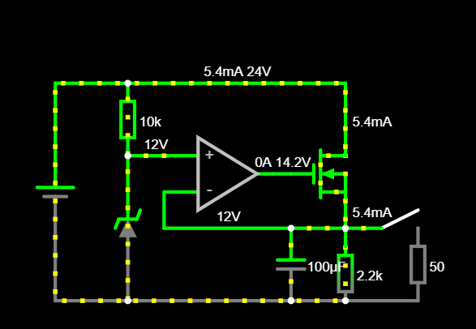

<h1 align="center"> Equilibrador PID </h1>

# Introdução
Projeto que visa explorar o funcionamento e aplicabildiade do sistema de controle PID, para isso o objetivo do mesmo será controlar a posição de uma bolinha, a qual será equilibrada em uma barra.

# Esboço da estrutura fisica

  
  
  

  

# Microcontrolador
Para o controle do equipamento será utilizado um arduino UNO que é munido do MCU Atmel328p que opera a 16Mhz. 
O motivo de sua escolha estão além do fator de disponibilidade, esta escolha se baseia na capacidade de processamento, seus atuadores disponiveis, facilidade de debug e o sistema nativo de comunicação Serial. Desta forma cumprindo os requisitos desejaveis para a execução do projeto. Claramente, unindo a isso a vasta comunidade já existente ao redor do mesmo o torna propricio para essa aplicação de metodologias.

# Sensores e atuadores
O controle do angulo da barra será utilizado um motor de passo ligado por correia a barra, o motor será controlador por um driver [TB6600](https://www.mcielectronics.cl/website_MCI/static/documents/TB6600_data_sheet.pdf) que possui funções como fracionamento dos passos.
ja para o sensor será utilizado o [HC-SR04](https://storage.googleapis.com/baudaeletronicadatasheet/HC-SR04.pdf) que consiste em um sensor de distância ultrassônico, o qual será responsável por identificar a distancia bolinha assim sabendo sua posição ao longo da barra.
# Metodologia
# Lista de materiais

