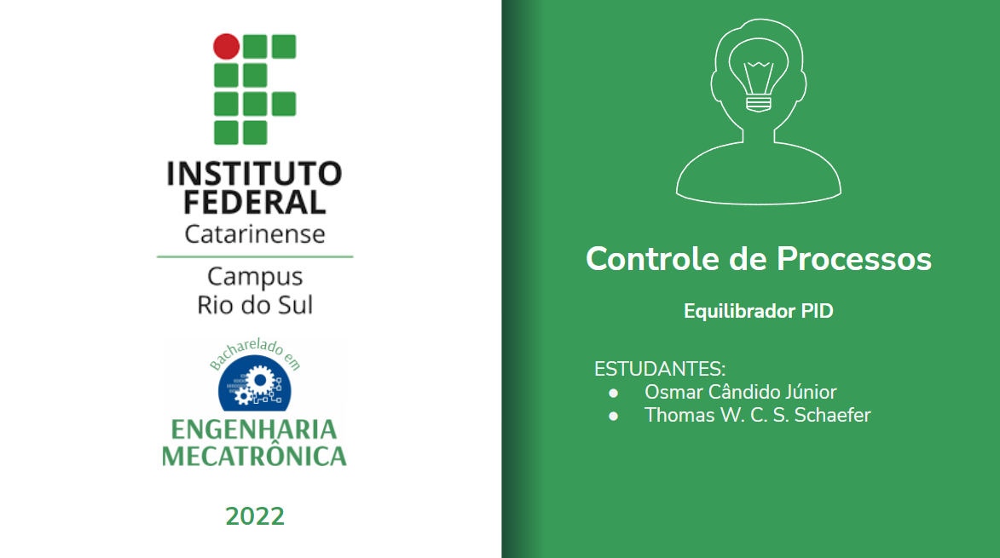

<h1 align="center"> Equilibrador PID </h1>

# Introdução
Projeto que visa explorar o funcionamento e aplicabilidade do sistema de controle PID, para isso o objetivo do mesmo será controlar a posição de uma bolinha, a qual será equilibrada em uma barra.

# Esboço da Estrutura Física

  
  <h3>Esboço Inicial</h3>
  
  
  <h3>Esboço com Medidas</h3>
  
  
  <h3 aling="left">Montagem</h3>
  

# Microcontrolador
Para o controle do equipamento será utilizado um [Arduino UNO]() que é munido do MCU [Atmega328P](https://pdf1.alldatasheet.com/datasheet-pdf/view/241077/ATMEL/ATMEGA328P.html) que opera a 16Mhz. 
O motivo de sua escolha estão além do fator de disponibilidade, esta escolha se baseia na capacidade de processamento, seus atuadores disponíveis, facilidade de debug e o sistema nativo de comunicação Serial. Desta forma cumprindo os requisitos desejaveis para a execução do projeto. Claramente, unindo a isso a vasta comunidade já existente ao redor do mesmo o torna proprício para essa aplicação de metodologias.

# Sensores e atuadores
O controle do ângulo da barra será efetuado por um [motor de passo]() ligado por correia a barra, o motor será controlador por um driver [TB6600](https://www.mcielectronics.cl/website_MCI/static/documents/TB6600_data_sheet.pdf) que possui funções como fracionamento dos passos do motor.
Já para o sensor será utilizado o [HC-SR04](https://storage.googleapis.com/baudaeletronicadatasheet/HC-SR04.pdf) que consiste em um sensor de distância ultrassônico, o qual será responsável por identificar a distancia bolinha assim sabendo sua posição ao longo da barra.

# Metodologia
1. Passo - `Definição dos Objetivos do Projeto`
2. Passo - `Esboço Estrutura Inicial`
3. Passo - `Esboço Estrutura Detalhado`
4. Passo - `Montagem`
5. Passo - `Alocação dos demais componentes`
6. Passo - `Programação`
7. Passo - `Conclusão`

# Lista de materiais
 - `Estrutura`
   - [Perfil de Aluminio leve v-Slot 40x40]()
     - Cortes: 
       -  2 un. 400mm
       -  3 un. 150mm
   - [Placa de conexão 90°]() 1 un.
   - [Capa de fechamento frontal quadrada]() 1 un.
   - [Polia Sincronizadora GT2 20 Dentes]() 2 un.
   - [Correia Sincronizadora GT2]() 600mm
   - [mola Tensionadora anti folga para Correia]() 1 un.
   - [Chapa L para Tensionamento de Correia]() 2 un.
 - `Atuadores e Demais Componentes`
   - [Motor de Passo]() 1 un.
   - [Driver TB6600]() 1 un.  
   - [Bola de Tenis de Mesa]() 1 un.  
   - [Fonte Alimentação]() 1 un.  
   - [Arduino Uno]() 1 un.  
   - [Display LCD 16x2]() 1 un.  
   - [Modulo I2C para display]() 1 un.  
   - [Botão](https://pt.aliexpress.com/item/1005001865063570.html?spm=a2g0o.productlist.0.0.30387d35B8lVv0&algo_pvid=47c8a6da-a321-4caf-8b6b-58afc68bd679&algo_exp_id=47c8a6da-a321-4caf-8b6b-58afc68bd679-28&pdp_ext_f=%7B%22sku_id%22%3A%2212000017981726696%22%7D&pdp_npi=2%40dis%21BRL%21%2140.34%21%21%21%21%21%400bb0622c16521390021906905e5017%2112000017981726696%21sea) 3 un.  

